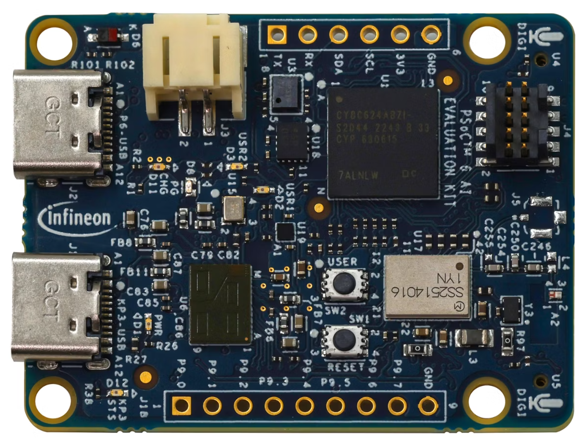
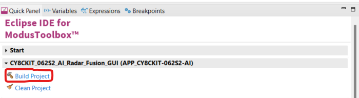
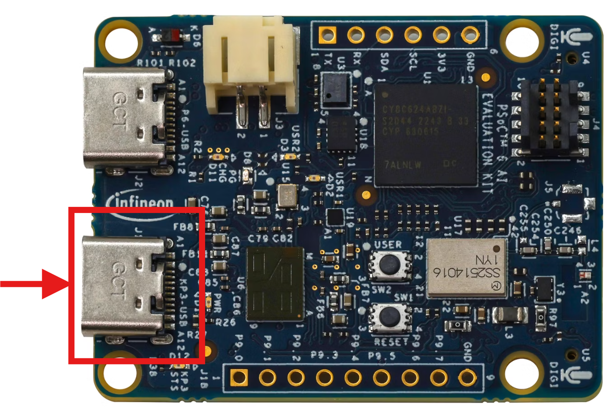
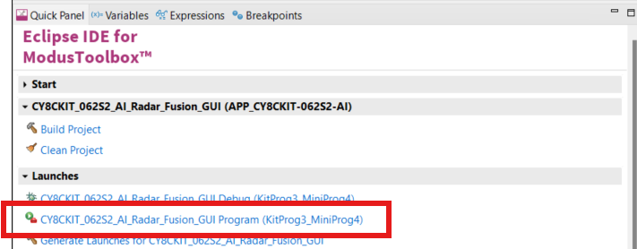
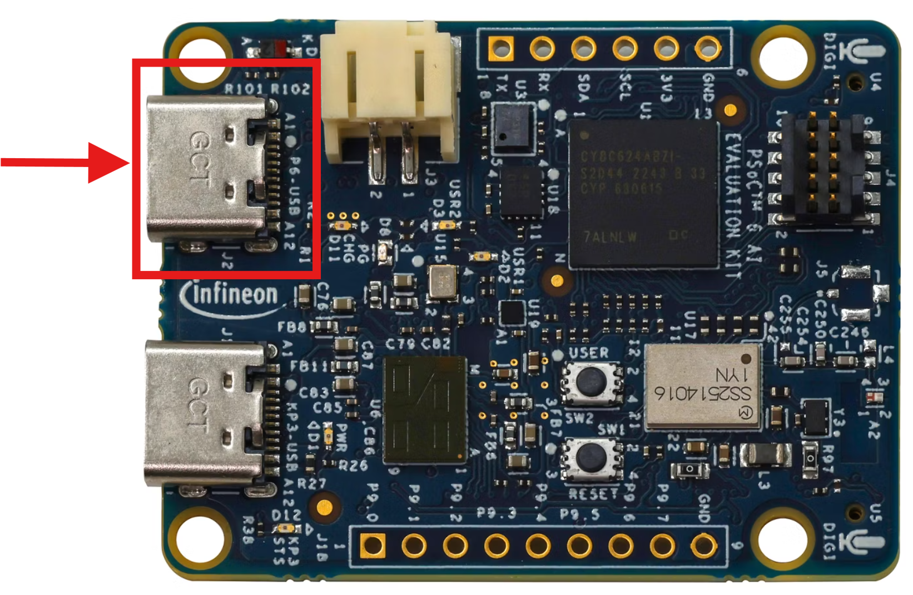
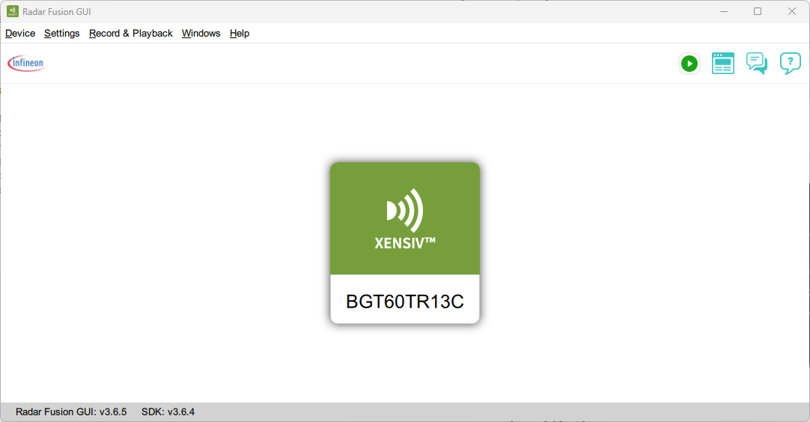
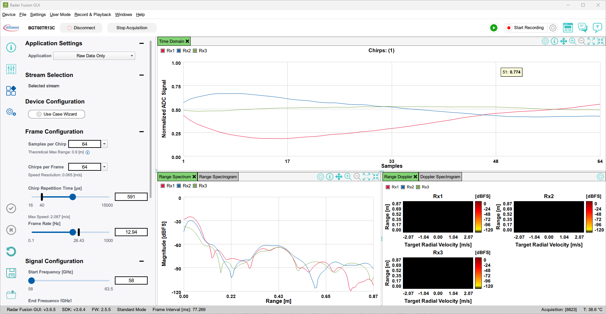

# CY8CKIT 062S2 AI Radar Fusion GUI

Enables to use the [CY8CKIT-062S2-AI dev board](https://www.infineon.com/evaluation-board/CY8CKIT-062S2-AI) with  [Infineon Radar Fusion GUI](https://softwaretools.infineon.com/tools/com.ifx.tb.tool.radarfusiongui).

## Requirements

- [ModusToolbox® software](https://www.infineon.com/cms/en/design-support/tools/sdk/modustoolbox-software/) **v2025.4.0** [tested with **v3.3**]
- [Radar Fusion GUI](https://softwaretools.infineon.com/tools/com.ifx.tb.tool.radarfusiongui) [tested with **v3.6.5**]
- [CY8CKIT-062S2-AI](https://www.infineon.com/evaluation-board/CY8CKIT-062S2-AI) Infineon Development Kit

## Supported toolchains (make variable 'TOOLCHAIN')

- GNU Arm&reg; Embedded Compiler v11.3.1 (`GCC_ARM`) - Default value of `TOOLCHAIN`

## Using the code example

- In **Eclipse IDE for ModusToolbox** click on File -> New -> ModusToolbox&trade; Application
- Select the **CY8CKIT-062S2-AI** in the list and click "Next >"
- In the "Sensing" category, select the **CY8CKIT-062S2-AI Radar Fusion GUI** application and click "Create".

This will create a project inside Modus Toolbox and download all the necessary resources.

Build the project by clicking on "Build Project" in the "Quick Panel".

Use USB-C cable to connect your laptop to the KP3_USB port of the CY8CKIT-062S2-AI.

Program the CY8CKIT-062S2-AI kit by clicking on "Program" in the "Quick Panel".

Use USB-C cable to connect your laptop to the P6_USB port of the CY8CKIT-062S2-AI.

Start the **Radar Fusion GUI** software. It should auto-detect the board.

Click on the **BGT60TR13C** icon. You should now see:

## Legal Disclaimer

The evaluation board including the software is for testing purposes only and, because it has limited functions and limited resilience, is not suitable for permanent use under real conditions. If the evaluation board is nevertheless used under real conditions, this is done at one’s responsibility; any liability of Rutronik is insofar excluded. 

